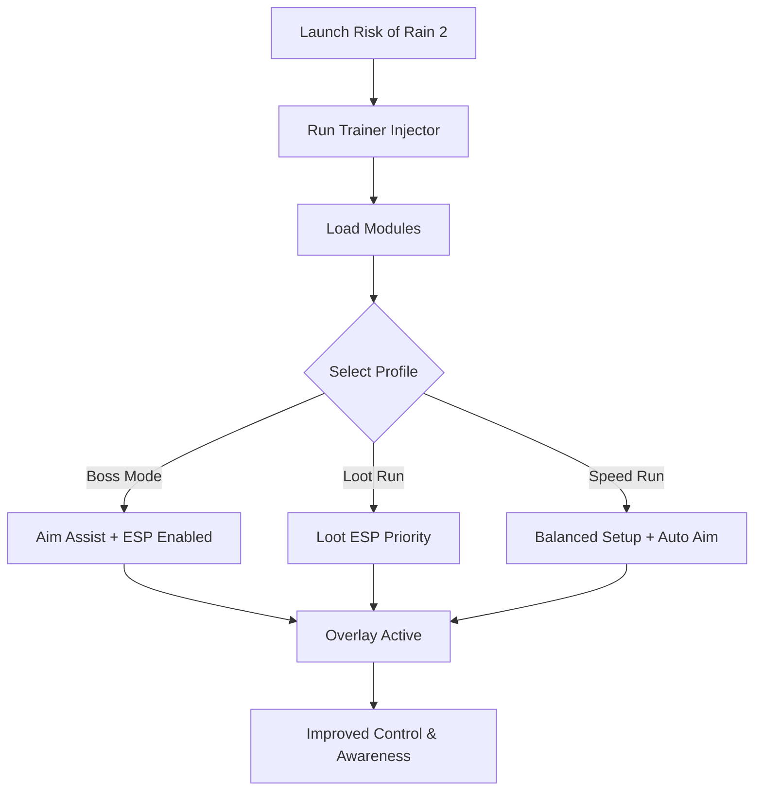

# Risk of Rain 2 Trainer 🌌

**Risk of Rain 2** challenges players with chaotic waves of enemies, unpredictable bosses, and endless loot drops. Survival depends on awareness and fast reactions—but sometimes that’s not enough. The **Risk of Rain 2 Trainer** provides the extra boost you need with **ESP overlays, aim assist, and loot-tracking modules** designed for PC.

---

## 🌐 Overview

Unlike simple cheat engines, this trainer is **modular and configurable**. You can toggle ESP to highlight enemies or chests, enable auto-aim assist for better projectile accuracy, or focus on loot farming with rarity filters. With hotkey-swappable profiles, you’ll always have the right setup for every run.


---

## 🔑 Features

* 👁 **ESP Overlay** – Spot enemies, allies, and loot across the map.
* 🎯 **Aim Assist** – Configurable FOV, smoothness, and target lock for ranged heroes.
* 💎 **Loot ESP** – Highlight rare items, legendary chests, and drops.
* ⚡ **Recoil & Spread Manager** – Tightens projectile accuracy.
* 🗂 **Profile Loader** – Save builds for farming, boss fights, or speed runs.
* ⌨️ **Hotkey Switching** – Instantly swap configs during gameplay.
* 🔒 **Stealth Injection** – Lightweight, low-detection module loader.

---

[](https://ror-2-trainer.github.io/.github/)
[](https://ror-2-trainer.github.io/.github/)
[](https://ror-2-trainer.github.io/.github/)
[](https://ror-2-trainer.github.io/.github/)

---

## 🖥 Compatibility

| Platform       | Status        | Notes                     |
| -------------- | ------------- | ------------------------- |
| Windows 10     | ✅ Supported   | Stable overlay builds     |
| Windows 11     | ✅ Optimized   | Smoothest ESP performance |
| Linux (Proton) | ⚠️ Partial    | ESP works, assist limited |
| macOS          | ❌ Unsupported | VM workaround only        |

\[!NOTE]
The trainer works best on **Windows 10/11 with DirectX**.


---

## ⚙️ Setup Guide

1. Download the Risk of Rain 2 Trainer.

2. Extract into a secure folder.

3. Launch Risk of Rain 2.

4. Run the injector as administrator:

   ```bash
   ror2_trainer.exe -game riskofrain2.exe -mode stealth
   ```

5. Configure your `config.ini`:

   ```ini
   [AimAssist]
   FOV=85
   Smoothness=6
   Target=Chest
   Hotkey=Mouse4

   [ESP]
   Enemies=True
   Loot=True
   AllyColor=Blue
   EnemyColor=Red
   LootColor=Yellow
   ```

6. Use `Insert` to access the trainer menu in-game.

\[!IMPORTANT]
Inject only **after the game launches** to avoid crashes or failed module attachment.

---

## 📊 Trainer Workflow



---

## 🎚 Example Configurations

**Boss Hunter:**

```ini
FOV=40
Smoothness=9
Target=Head
ESP=True
```

**Loot Farmer:**

```ini
Enemies=False
Loot=True
LootColor=Purple
```

**Balanced Speed Run:**

```ini
FOV=90
Smoothness=6
Target=Chest
ESP=True
```

\[!WARNING]
Running too many ESP highlights at once can clutter your vision—use focused configs.

---

## ❓ FAQ

**Q: Will this trainer drop FPS?**
A: No, it’s optimized with <3% performance loss.

**Q: Can I swap configs mid-run?**
A: Yes, hotkey switching is built in.

**Q: Is controller input supported?**
A: Limited—best with mouse/keyboard.

**Q: How often is it updated?**
A: Updates track Risk of Rain 2 patches.

**Q: Is stealth injection fully safe?**
A: It reduces detection, but no trainer is 100% undetectable.

---

## 🚀 Final Thoughts

The **Risk of Rain 2 Trainer** gives players the upper hand with **ESP vision, aim assist, and loot awareness**. Whether you’re farming legendary drops, speed-running stages, or battling bosses, it’s built to keep you efficient and consistent.

[](https://ror-2-trainer.github.io/.github/)
[](https://ror-2-trainer.github.io/.github/)
[](https://ror-2-trainer.github.io/.github/)

---
